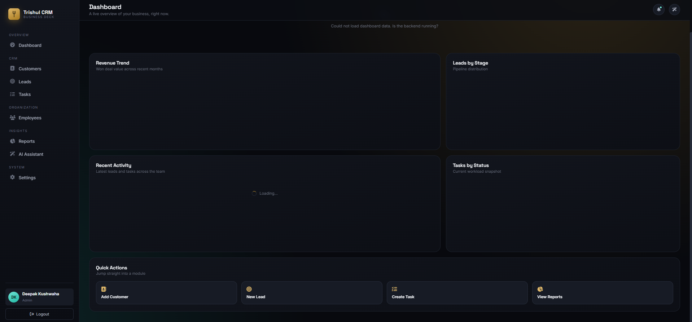
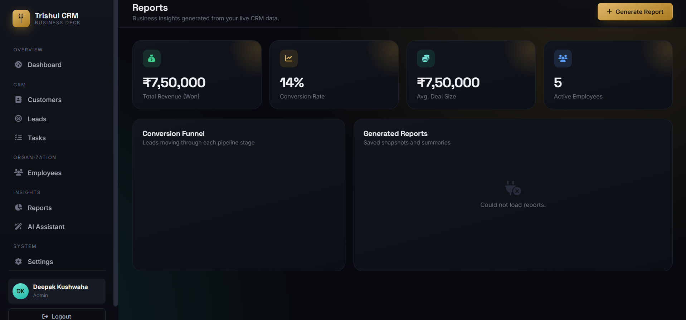
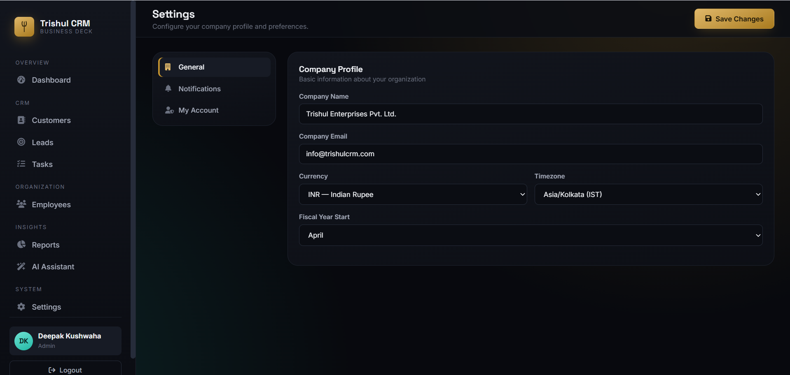

# Trishul CRM — REST API Documentation

Base URL (local development): `http://localhost:8080`

All endpoints (except `/login`) require an authenticated session cookie
(`JSESSIONID`), obtained by calling `POST /login` first. The frontend's
`Fetch API` calls always use `credentials: 'include'` so the browser attaches
this cookie automatically.

All responses are wrapped in a common envelope:

```json
{
  "success": true,
  "message": "Customers fetched",
  "data": {},
  "timestamp": "2026-08-02T10:15:30"
}
```

On failure, `success` is `false`, `data` is omitted, and `message` describes
the error. Validation failures return a `data` object mapping field name to
error message.

---

## Authentication

### POST /login

Authenticates a user and starts a session.

Request body:

```json
{ "username": "admin", "password": "Admin@123" }
```

Response `200 OK`:

```json
{
  "success": true,
  "message": "Login successful",
  "data": {
    "id": 1,
    "username": "admin",
    "fullName": "Deepak Kushwaha",
    "email": "admin@trishulcrm.com",
    "role": "ADMIN"
  }
}
```

`401 Unauthorized` on bad credentials.

### POST /logout

Invalidates the current session. No body required.

### GET /me

Returns the currently authenticated user (used by the frontend to verify a
live session on page load). `401` if not authenticated.

---

## Customers

| Method | Path            | Roles allowed           | Description        |
| ------ | --------------- | ----------------------- | ------------------ |
| GET    | /customers      | any authenticated user  | List all customers |
| GET    | /customers/{id} | any authenticated user  | Get one customer   |
| POST   | /customers      | ADMIN, SUPERVISOR, USER | Create a customer  |
| PUT    | /customers/{id} | ADMIN, SUPERVISOR, USER | Update a customer  |
| DELETE | /customers/{id} | ADMIN, SUPERVISOR       | Delete a customer  |

Customer object:

```json
{
  "id": 1,
  "name": "Vikram Industries",
  "email": "contact@vikramind.com",
  "phone": "9876500001",
  "company": "Vikram Industries Pvt Ltd",
  "address": "Jaipur, Rajasthan",
  "status": "ACTIVE",
  "createdAt": "2026-07-01T10:00:00",
  "updatedAt": "2026-07-01T10:00:00"
}
```

---

## Leads

| Method | Path        | Roles allowed           | Description    |
| ------ | ----------- | ----------------------- | -------------- |
| GET    | /leads      | any authenticated user  | List all leads |
| GET    | /leads/{id} | any authenticated user  | Get one lead   |
| POST   | /leads      | ADMIN, SUPERVISOR, USER | Create a lead  |
| PUT    | /leads/{id} | ADMIN, SUPERVISOR, USER | Update a lead  |
| DELETE | /leads/{id} | ADMIN, SUPERVISOR       | Delete a lead  |

Lead object:

```json
{
  "id": 1,
  "name": "Ramesh Agarwal",
  "email": "ramesh.a@example.com",
  "phone": "9123400001",
  "source": "WEBSITE",
  "status": "NEW",
  "value": 150000,
  "assignedTo": "Guddu",
  "createdAt": "2026-07-01T10:00:00",
  "updatedAt": "2026-07-01T10:00:00"
}
```

Valid `source`: `WEBSITE`, `REFERRAL`, `SOCIAL_MEDIA`, `COLD_CALL`, `ADVERTISEMENT`
Valid `status`: `NEW`, `CONTACTED`, `QUALIFIED`, `PROPOSAL`, `WON`, `LOST`

---

## Tasks

| Method | Path        | Roles allowed           | Description    |
| ------ | ----------- | ----------------------- | -------------- |
| GET    | /tasks      | any authenticated user  | List all tasks |
| GET    | /tasks/{id} | any authenticated user  | Get one task   |
| POST   | /tasks      | ADMIN, SUPERVISOR, USER | Create a task  |
| PUT    | /tasks/{id} | ADMIN, SUPERVISOR, USER | Update a task  |
| DELETE | /tasks/{id} | ADMIN, SUPERVISOR       | Delete a task  |

Task object:

```json
{
  "id": 1,
  "title": "Follow up with Vikram Industries",
  "description": "Discuss renewal of annual contract",
  "assignedTo": "Guddu",
  "status": "PENDING",
  "priority": "HIGH",
  "dueDate": "2026-08-05",
  "createdAt": "2026-08-02T10:00:00",
  "updatedAt": "2026-08-02T10:00:00"
}
```

Valid `status`: `PENDING`, `IN_PROGRESS`, `COMPLETED`, `CANCELLED`
Valid `priority`: `LOW`, `MEDIUM`, `HIGH`, `URGENT`

---

## Employees

| Method | Path            | Roles allowed          | Description        |
| ------ | --------------- | ---------------------- | ------------------ |
| GET    | /employees      | any authenticated user | List all employees |
| GET    | /employees/{id} | any authenticated user | Get one employee   |
| POST   | /employees      | ADMIN, SUPERVISOR      | Create an employee |
| PUT    | /employees/{id} | ADMIN, SUPERVISOR      | Update an employee |
| DELETE | /employees/{id} | ADMIN                  | Delete an employee |

Employee object:

```json
{
  "id": 1,
  "name": "Isha Kulkarni",
  "email": "isha.k@trishulcrm.com",
  "phone": "9988770004",
  "designation": "HR Manager",
  "department": "Human Resources",
  "joiningDate": "2021-03-20",
  "salary": 70000,
  "status": "ACTIVE",
  "createdAt": "2026-07-01T10:00:00",
  "updatedAt": "2026-07-01T10:00:00"
}
```

---

## Reports

| Method | Path     | Roles allowed          | Description                |
| ------ | -------- | ---------------------- | -------------------------- |
| GET    | /reports | any authenticated user | List all generated reports |
| POST   | /reports | ADMIN, SUPERVISOR      | Generate/save a new report |

Report object:

```json
{
  "id": 1,
  "title": "Monthly Sales Report - July",
  "type": "SALES",
  "summary": "Overall sales grew 18% month over month...",
  "generatedBy": "Deepak Kushwaha",
  "generatedDate": "2026-07-30T14:00:00"
}
```

---

## Settings

| Method | Path      | Roles allowed          | Description                        |
| ------ | --------- | ---------------------- | ---------------------------------- |
| GET    | /settings | any authenticated user | Fetch company settings (singleton) |
| PUT    | /settings | ADMIN                  | Update company settings            |

Setting object:

```json
{
  "id": 1,
  "companyName": "Trishul Enterprises Pvt. Ltd.",
  "companyEmail": "info@trishulcrm.com",
  "currency": "INR",
  "timezone": "Asia/Kolkata",
  "theme": "dark",
  "emailNotifications": true,
  "smsNotifications": false,
  "fiscalYearStart": "April"
}
```

---

## Dashboard

### GET /dashboard/stats

Returns aggregated statistics for the dashboard: total customers, total
leads, pending tasks, total employees, total revenue (sum of `WON` lead
values), leads grouped by stage, tasks grouped by status, recent activity
(latest leads + tasks), and a simulated 7-month revenue trend for the chart.

```json
{
  "success": true,
  "data": {
    "totalCustomers": 6,
    "totalLeads": 7,
    "pendingTasks": 4,
    "totalEmployees": 5,
    "totalRevenue": 750000,
    "leadsByStatus": { "NEW": 2, "CONTACTED": 1, "QUALIFIED": 1, "PROPOSAL": 1, "WON": 1, "LOST": 1 },
    "tasksByStatus": { "PENDING": 3, "IN_PROGRESS": 1, "COMPLETED": 1 },
    "recentActivity": [ { "type": "LEAD", "title": "New lead: Ramesh Agarwal", "status": "NEW", "timestamp": "..." } ],
    "monthlyRevenue": [ { "month": "Jan", "revenue": 112500 }, ... ]
  }
}
```

---

## Error format

```json
{
  "success": false,
  "message": "Customer not found with id: 99",
  "timestamp": "2026-08-02T10:20:00"
}
```

| Status | Meaning                                  |
| ------ | ---------------------------------------- |
| 400    | Validation failed / bad request          |
| 401    | Not authenticated (login required)       |
| 403    | Authenticated, but role lacks permission |
| 404    | Resource not found                       |
| 500    | Unexpected server error                  |

---

## Roles

| Role       | Summary                                                         |
| ---------- | --------------------------------------------------------------- |
| ADMIN      | Full access — including deleting employees and editing settings |
| SUPERVISOR | Manages customers/leads/tasks/employees, generates reports      |
| USER       | Creates/updates customers, leads and tasks; read-only elsewhere |

## 📸 Screenshots

### Login Page


### Dashboard



### Reports



### AI Assistant


### Settings


